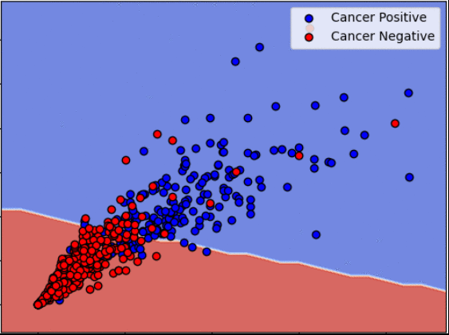
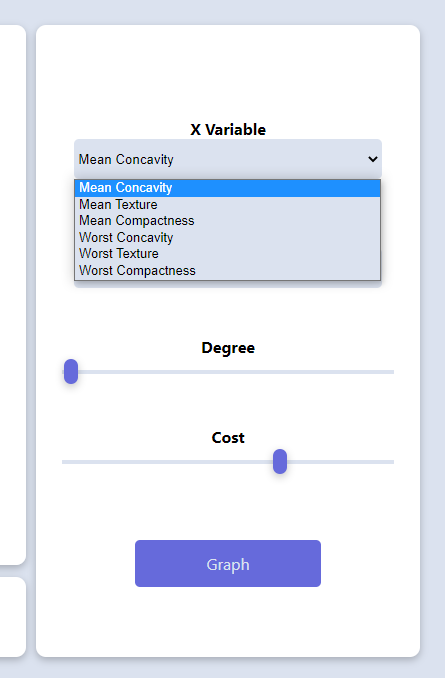
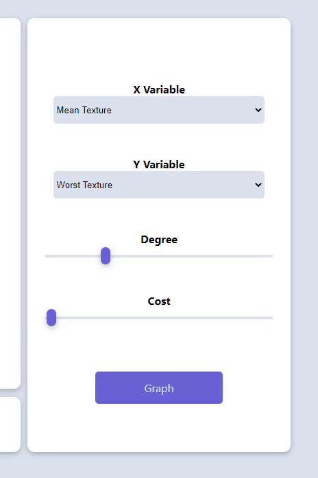
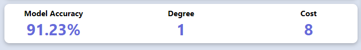
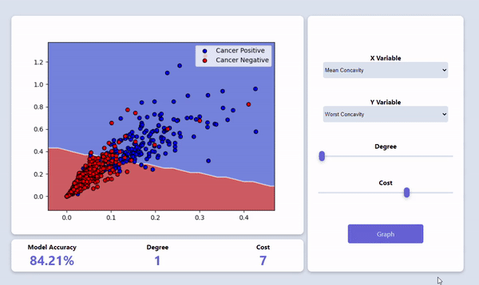

# [Cancer Classifier](https://rdey0.github.io/cancer_classifier/)

    
    
    
    
    
    
    
    

    

<h1></h1>

## [Demo](https://rdey0.github.io/cancer_classifier/)

## Description

Customize your own machine learning model to detect the presence of cancer. This cancer classifier uses a support vector machine trained on data and hyperparameters of your choosing. Play around and see what combinations of data sets and hyperparameters allow you to produce the most accurate classifications.

## How to Use

1. **Select Variables**: Choose X and Y variable datasets from the "X Variable" and "Y Variable" select boxes. These are the datasets that your machine learning model will learn from. Don't worry about which dataset is the X or the Y variable, it's only the combination of data sets that matters

 

    

 

2. **Select Hyperparameters**: Use the sliders to choose your Cost and Degree hyperparameters. Cost determines how heavily to punish your model for incorrectly classifying data points. The higher the cost, the greater the punishment. Degree determines how flexible the decision boundary can be. The higher the degree, the 'curvier' the separating line may appear.

 

    

 

    
    
<b>The metrics panel shows you your model accuracy, selected cost, and selected degree</b>

 

3. **Graph**: Click the graph button and a model will be trained with your chosen parameters and make classification predictions. The graph will update to show where your model believes cancer positive and cancer negative patients are located. Blue regions are where your model thinks cancer positive patients are while red regions are where your model thinks cancer negative patients are.

 

    

 

## How it was Made

React was used as the front-end framework. The machine learning algorithms were written in python and are run on a Node.js server. The Node server runs the python scripts and returns the resulting graph and outcome metrics via API calls.
